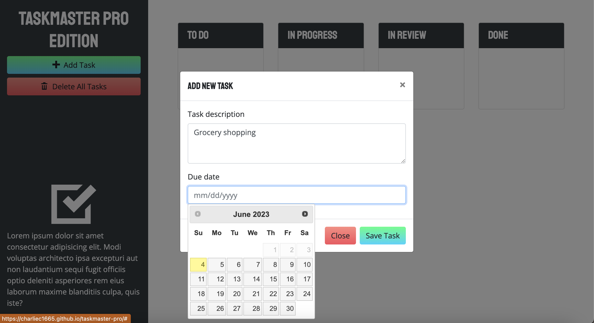
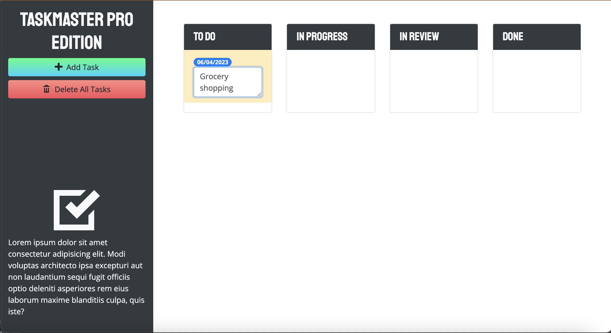
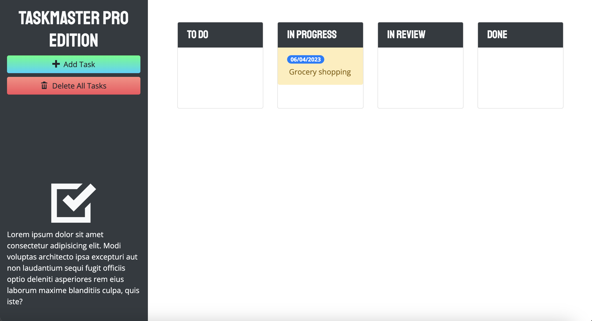

# Taskmaster Pro

## Description

Taskmaster Pro is a task tracking application written in JavaScript and incorporates third-party libraries jQuery and Bootstrap. Taskmaster comes from legacy code which was updated and modified to allow editing of tasks, adds drag and drop capabilities, adds a calendar date-picker for task due dates, and adds periodic checks to determine if tasks are overdue.

## Table of Contents

[Installation](#installation)
[Usage](#usage)
[Credits](#credits)

## Installation

In order to use the application, simply visit the deployed web page [here](https://charliec1665.github.io/taskmaster-pro/)!

## Usage

Add Tasks.
 
 

 
 
 

Edit Tasks.
 
 

 
 
 

Drag Tasks.
 
 

 
 
 

## Credits

Legacy code from UNC Charlotte Coding Bootcamp. 
Refactored code made with 💛 by me, Charlie.

You can see more of my work [here](https://github.com/charliec1665), on GitHub.